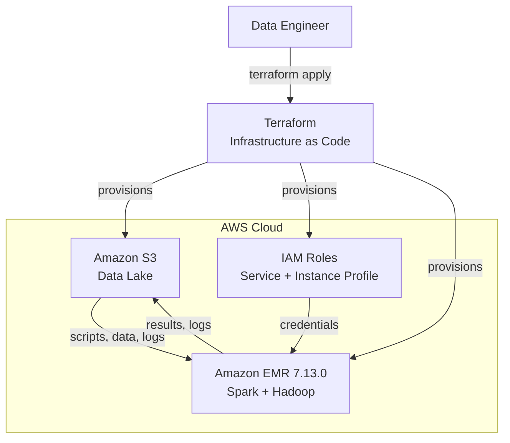
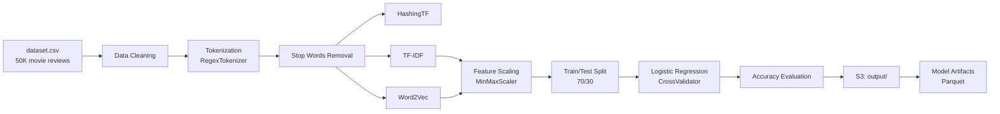

# Terraform AWS EMR PySpark

Infrastructure as Code for provisioning an Amazon EMR cluster to run distributed PySpark machine learning workloads for sentiment analysis on movie reviews.

## Overview

This project provisions a complete AWS data engineering environment using Terraform: an S3 data lake, IAM security roles, and an Amazon EMR cluster with Apache Spark. The cluster automatically executes a multi-step PySpark pipeline that performs text feature extraction (HashingTF, TF-IDF, Word2Vec) and trains a Logistic Regression classifier with cross-validation.

**Problem solved:** Automated provisioning of ephemeral, cost-optimized EMR clusters for distributed NLP model training, with all infrastructure defined as code.

**Services used:** S3, IAM, EMR, EC2

## Architecture



**Component details:**

| Component | Resource | Purpose |
|-----------|----------|---------|
| **S3** | Bucket `terraform-aws-emr-pyspark-<account-id>` | Stores pipeline scripts, dataset, bootstrap scripts, logs, and ML model output |
| **IAM** | EMR service role | Allows EMR to call AWS services on your behalf |
| **IAM** | EC2 instance profile | Grants EC2 instances in the cluster access to S3 |
| **EMR** | Cluster `emr-7.13.0` | Managed Spark cluster with 1 master (`m5.4xlarge`) + 2 core nodes (`m5.2xlarge`) |
| **EC2** | Security groups | SSH access to master node, internal communication between core nodes |

## Project Structure

```
.
├── Dockerfile
├── IaC/
│   ├── config.tf                    # Terraform backend & provider configuration
│   ├── main.tf                      # Root module — orchestrates S3, IAM, and EMR
│   ├── variables.tf                 # Input variable declarations
│   ├── terraform.tfvars             # Environment-specific values
│   ├── terraform.tfvars.example     # Example configuration file
│   ├── data/
│   │   └── dataset.csv              # 50,000 movie reviews with sentiment labels
│   ├── pipeline/
│   │   ├── terraform_aws_emr_pyspark.py  # Main entry point — orchestrates the pipeline
│   │   ├── processing.py            # Data cleaning, tokenization, feature extraction
│   │   ├── ml.py                    # Logistic Regression training with cross-validation
│   │   ├── log.py                   # Local + S3 logging utility
│   │   └── upload_s3.py            # S3 upload helpers for Parquet and ML models
│   ├── scripts/
│   │   └── bootstrap.sh            # EMR bootstrap — installs Python environment
│   └── modules/
│       ├── s3/                      # S3 bucket, versioning, encryption, object uploads
│       │   └── s3_objects/          # S3 folder structure and file uploads
│       ├── iam/                     # IAM roles and instance profile for EMR
│       └── emr/                     # EMR cluster, security groups, cluster steps
└── README.md
```

## Infrastructure Components

### S3 Module (`IaC/modules/s3/`)

Creates a secure S3 bucket with:

| Resource | Configuration |
|----------|---------------|
| `aws_s3_bucket` | Globally unique bucket name with account ID suffix |
| `aws_s3_bucket_versioning` | Versioning enabled |
| `aws_s3_bucket_public_access_block` | All public access blocked |
| `aws_s3_bucket_server_side_encryption_configuration` | SSE-AES256 encryption by default |
| `aws_s3_object` (pipeline scripts) | `pipeline/*.py` — tracked via `etag` for change detection |
| `aws_s3_object` (dataset) | `data/dataset.csv` — tracked via `etag` |
| `aws_s3_object` (bootstrap) | `scripts/bootstrap.sh` — tracked via `etag` |
| `aws_s3_object` (folders) | Placeholder objects for `logs/`, `output/`, `data/` prefixes |

### IAM Module (`IaC/modules/iam/`)

| Resource | Purpose |
|----------|---------|
| `aws_iam_role` (`iam_emr_service_role`) | Trusts `elasticmapreduce.amazonaws.com` — attached to `AmazonElasticMapReduceRole` |
| `aws_iam_role` (`iam_emr_profile_role`) | Trusts `ec2.amazonaws.com` — attached to `AmazonElasticMapReduceforEC2Role` |
| `aws_iam_instance_profile` | Links the EC2 role to EMR cluster instances |

### EMR Module (`IaC/modules/emr/`)

**Cluster configuration:**

| Setting | Value |
|---------|-------|
| Release | `emr-7.13.0` |
| Applications | Hadoop, Spark |
| Master | `m5.4xlarge` (1 node) |
| Core | `m5.2xlarge` (2 nodes) |
| Termination protection | Disabled (allows `terraform destroy`) |
| Auto-termination | Enabled (cluster terminates after all steps complete) |

**Spark configuration:**

- Dynamic allocation enabled
- Python interpreter: Miniconda at `/home/hadoop/conda/bin/python`
- Network timeout: 800s
- Heartbeat interval: 60s
- `S3_BUCKET_NAME` injected as environment variable to executors and driver

**Security groups:**

| Group | Inbound | Outbound |
|-------|---------|----------|
| Main (master) | SSH from `0.0.0.0/0` on port 22 | All traffic |
| Core | All traffic within the security group | All traffic |

**Cluster steps (executed sequentially):**

| # | Step | Failure behavior |
|---|------|-----------------|
| 1 | Copy pipeline scripts from S3 to `/home/hadoop/pipeline/` | Terminate cluster |
| 2 | Copy log files from S3 to `/home/hadoop/logs/` | Terminate cluster |
| 3 | Run `spark-submit terraform_aws_emr_pyspark.py` | Continue (keep cluster alive for debugging) |

**Bootstrap action:**

Executes `bootstrap.sh` on every node before Spark starts:
- Downloads and installs Miniconda
- Installs Python packages: `findspark`, `boto3`, `numpy`, `pendulum`, `python-dotenv`, `scikit-learn`
- Creates working directories: `~/pipeline/`, `~/logs/`

## Data Flow



**Pipeline execution flow:**

1. **Data ingestion:** CSV loaded from `s3://<bucket>/data/dataset.csv` (or local `data/` directory)
2. **Null handling:** Columns with missing values are identified, logged, and dropped
3. **Class balance:** Positive/negative sentiment counts are logged
4. **Label encoding:** `StringIndexer` maps `positive`/`negative` to `0`/`1`
5. **Text cleaning:** HTML tags removed, special characters stripped, whitespace normalized, lowercased
6. **Tokenization:** `RegexTokenizer` splits text into word tokens
7. **Stop words removal:** `StopWordsRemover` filters common words
8. **Feature extraction:** Three parallel pipelines — HashingTF, TF-IDF (with IDF), Word2Vec (with MinMaxScaler)
9. **Model training:** Logistic Regression with 2-fold cross-validation over `maxIter` ∈ {10, 15, 20}
10. **Evaluation:** Accuracy calculated via `MulticlassClassificationEvaluator`
11. **Output:** Trained models and evaluation results saved to S3 in Parquet format

## Prerequisites

- **Terraform** `~> 1.15`
- **AWS CLI** installed and configured (`aws configure`)
- **AWS Account** with permissions to create S3 buckets, IAM roles, and EMR clusters
- **Docker** (optional — for containerized execution)

## Deployment

### 1. Clone and configure

```bash
git clone <repository-url>
cd terraform-aws-emr-pyspark/IaC
```

### 2. Create the S3 backend bucket (manual step)

The Terraform remote state backend requires a pre-existing S3 bucket. Create it before running `terraform init`:

```bash
aws s3api create-bucket \
  --bucket terraform-aws-emr-pyspark-<your-aws-account-id> \
  --region us-east-2 \
  --create-bucket-configuration LocationConstraint=us-east-2
```

Replace `<your-aws-account-id>` with your 12-digit AWS account ID.

### 3. Configure terraform.tfvars

Edit `terraform.tfvars` with your values:

```hcl
bucket_name        = "terraform-aws-emr-pyspark-<your-aws-account-id>"
emr_cluster_name   = "distributed-pyspark-training-<your-aws-account-id>"
bucket_versioning  = "Enabled"
pipeline_directory = "./pipeline"
data_directory     = "./data"
scripts_directory  = "./scripts"
```

Also update the backend bucket name in `config.tf` line 18 to match your bucket.

### 4. Initialize and apply

```bash
terraform init
terraform plan
terraform apply
```

### 5. Using Docker (alternative)

```bash
# Build the image
docker build -t terraform-image:emr-pyspark .

# Run the container with AWS credentials mounted
docker run -it --name emr-pyspark \
  -v $(pwd)/IaC:/iac \
  -v ~/.aws:/root/.aws \
  terraform-image:emr-pyspark /bin/bash

# Inside the container
cd /iac
terraform init
terraform apply
```

### 6. Monitor the cluster

```bash
# Check EMR cluster status via AWS CLI
aws emr describe-cluster --cluster-id <cluster-id> --region us-east-2

# View cluster steps
aws emr list-steps --cluster-id <cluster-id> --region us-east-2

# Access logs in S3
aws s3 ls s3://terraform-aws-emr-pyspark-<account-id>/logs/ --region us-east-2
```

### 7. Clean up

```bash
cd IaC
terraform destroy
```

## Security Considerations

| Aspect | Implementation |
|--------|---------------|
| **S3 encryption** | SSE-AES256 enabled by default on all objects |
| **S3 public access** | All four block settings enabled — no public access possible |
| **S3 versioning** | Enabled — protects against accidental deletion |
| **IAM least privilege** | AWS-managed policies scoped to EMR requirements only |
| **Credential handling** | No hardcoded keys — instance profile credential chain used by boto3 |
| **Remote state** | Stored in S3 with `encrypt = true` |
| **SSH access** | Open to `0.0.0.0/0` (not recommended for production — restrict to your IP) |
| **State locking** | Not implemented (DynamoDB not configured) |

## Monitoring and Logging

- **EMR logs:** Automatically written to `s3://<bucket>/logs/` on an ongoing basis
- **Application logs:** `log.py` writes timestamped entries to `/home/hadoop/logs/YYYYMMDD-log_spark.txt` and uploads to S3
- **Cluster metrics:** Available via AWS EMR console and CloudWatch (EMR publishes metrics automatically)
- **Spark UI:** Accessible via SSH tunnel to the master node (port 8080 for Spark UI, 8088 for YARN)

```bash
# SSH tunnel for Spark UI
ssh -i <key.pem> -N -L 8080:localhost:8080 hadoop@<master-public-dns>

# Spark UI
open http://localhost:8080
```

## Future Improvements

- [ ] Add DynamoDB table for Terraform state locking
- [ ] Restrict SSH inbound rule to a specific CIDR block
- [ ] Implement S3 lifecycle policies for log rotation
- [ ] Add CloudWatch alarms for cluster metrics
- [ ] Configure EMR auto-scaling rules
- [ ] Add CI/CD pipeline (GitHub Actions) for Terraform plan on PR
- [ ] Support multiple classifiers (Random Forest, Gradient Boosted Trees) in the ML pipeline
- [ ] Add VPC with private subnets and NAT gateway
- [ ] Implement KMS customer-managed keys for S3 encryption
- [ ] Add resource tagging strategy for cost tracking
- [ ] Integrate EMR Studio for interactive notebook development

## Lessons Learned

- **`depends_on` is critical:** Without explicit dependency between the S3 module and EMR module, Terraform may provision the cluster before scripts are uploaded to S3, causing bootstrap failures.
- **Environment variables on EMR:** Injecting values via `spark-env` classification in `configurations_json` is the standard way to pass runtime configuration to PySpark jobs on EMR.
- **Instance profile credential chain:** boto3 automatically picks up credentials from the EC2 instance profile on EMR — no need for access keys in code or environment variables.
- **Ephemeral clusters save cost:** With `keep_job_flow_alive_when_no_steps = false`, the cluster auto-terminates after the pipeline completes, avoiding idle compute charges.
- **`fileset` returns only regular files:** Terraform's `fileset` function excludes directories, making it safe for recursive S3 object uploads.
